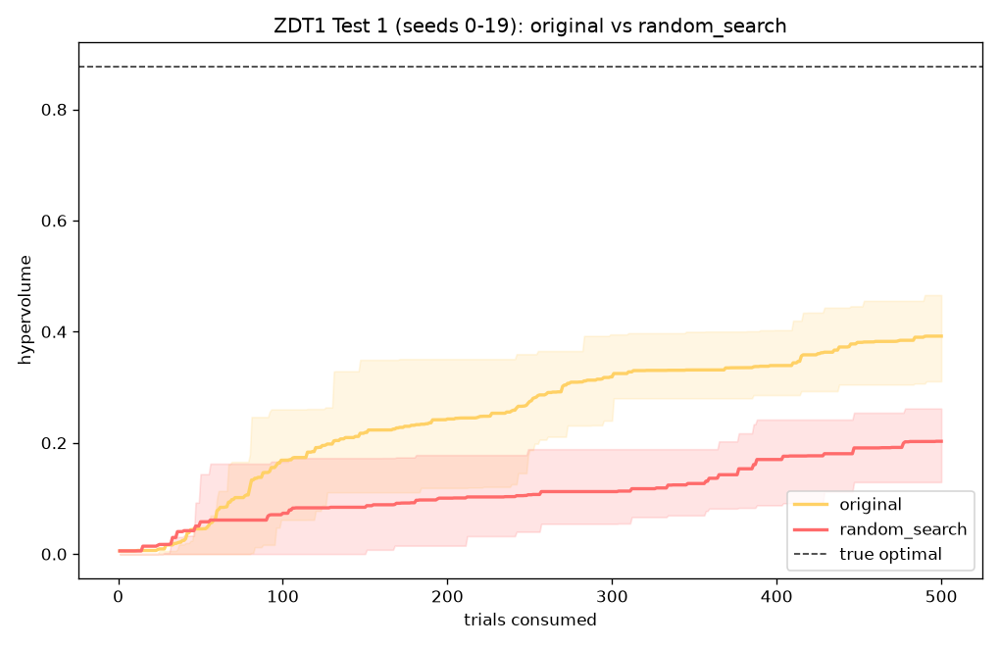
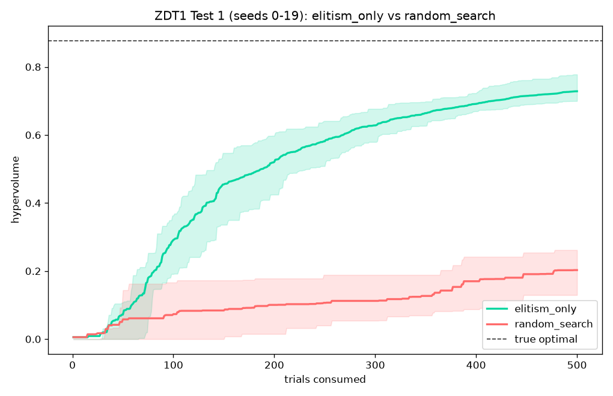
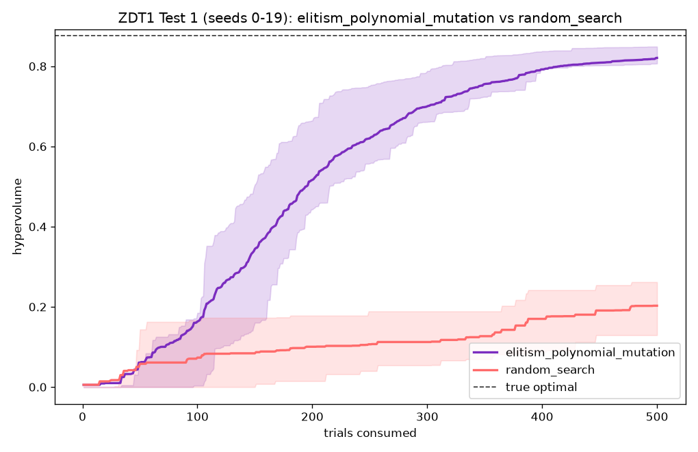
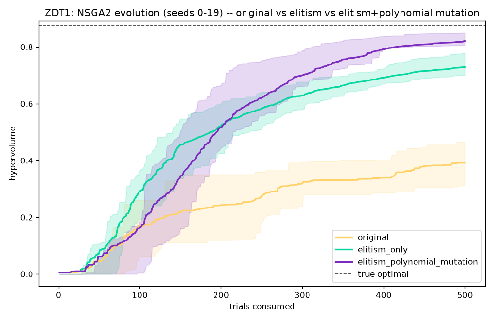
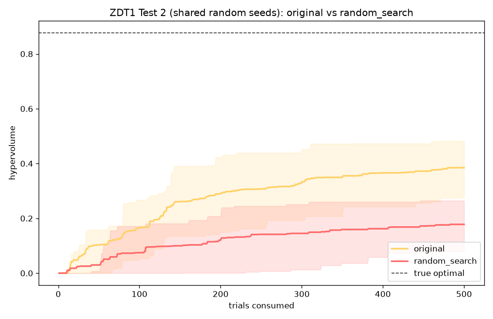
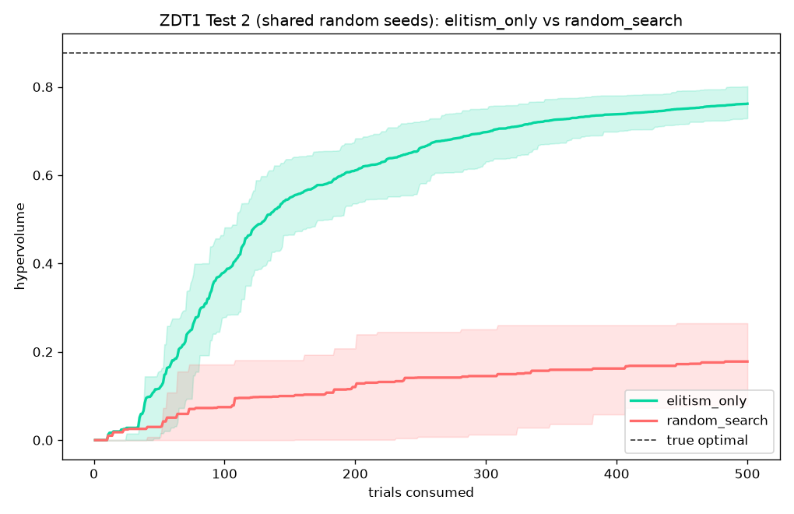
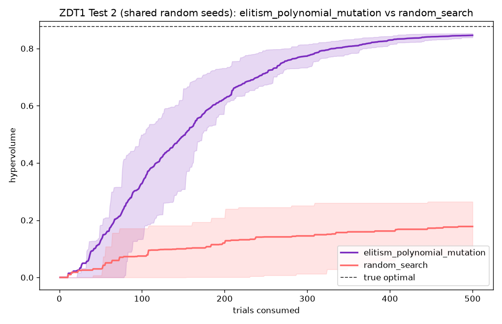

# NSGA-II Evolution and Evaluation

- **Status:** Ongoing
- **Author:** Emily Tew <3
- **Scope:** Determining the empirical effectiveness of the NSGA-2

---

# Timeline

1. The **Original NSGA2** is the first version of the algorithm covered 
by the original design notes. It featured non-dominated sorting, crowding distance, 
tournament selection, uniform crossover, and mutation that fully replaces a value with a fresh
   random draw. There was no implemented elitism, meaning one completed generation bred the next
   directly. As a result, a strong individual could potentially be lost if it didn't
   make it into the next generation's parent pool by chance.
2.  **Added Elitism** added the `_select_survivors` function in `nsga2.py`. With the improved breeding process
each new generation combines the surviving parent population with the
   newest offspring, ranks the combined pool, and keeps only the best
   `population_size` individual as opposed to instead of breeding purely from the
   latest batch.
3. **+ Polynomial mutation** has finally been added via `_polynomial_mutate_value` in `nsga2.py`), where
   FLOAT/INTEGER parameters are now perturbed near their current value
   instead of being fully reset on mutation. With this change, CATEGORICAL parameters retain
   the original random draw behavior, since "nearby" means nothing
   for an unordered discrete set.

---

# Evaluation

To evaluate the performance of each evolution, a ZDT1 arithmetic test was used to compare the NSGA-2 algorithm to the 
project's default `random_search` algorithm. For the sake of testing, a deterministic seeds were used (1-20) for both
algorithms. These were the results of each evolution:

Final hypervolume after a full run, as a percentage of ZDT1's true
optimal hypervolume (reference point `(1.1, 1.1)`, true optimal
`0.8766`):

| version | mean final hypervolume | % of optimal | seeds x trials |
|---|---|---|---|
| baseline (no elitism, full-reset mutation) | 0.3920 | 44.7% | 20 x 500 |
| + elitism | 0.7163 | 81.7% | 10 x 500 |
| + elitism + polynomial mutation (current, shipped) | 0.8272 | 94.4% | 10 x 500 |

Each step is a real, measured improvement in how close the algorithm gets
to the true Pareto front by the end of a run -- roughly doubling its share
of the optimal hypervolume from the original implementation to the
version currently on `main`.

---

# Budget-checkpoint story

A large trial budget is only affordable because ZDT1 is synthetic and
near-instant. The question that actually matters for a real (slow) worker
is whether NSGA2's advantage shows up early, not just eventually. Reusing
each seed's already-collected trace (no extra worker trials), checked at
fixed trial counts:

| trials | elitism-only: p-value | elitism + polynomial mutation: p-value |
|---|---|---|
| 10 | tied | tied |
| 25 | not significant | not significant |
| 50 | not significant | not significant |
| 100 | **significant (p=0.0007)** | not significant (p=0.73) |

Polynomial mutation traded away the early-budget advantage elitism-only
had established by 100 trials, in exchange for the much better final
result in the table above. Nudging a value near itself explores the space
more slowly and cautiously early on than a full random reset does, so the
algorithm needs more trials before its lead over random search becomes
statistically provable -- even though it ends up in a substantially
better place once it gets there.

**Open question this doc is resolving with fresh data:** at what trial
count does the *current* shipped algorithm (elitism + polynomial
mutation) actually become significantly better than random search? 100
trials is not the answer -- measured directly above.

---

# Random-seed validation

Every result above used the deterministic seed range `0..N-1`, which is
what `compare_search_algorithms.py`'s `--seeds N` flag always produces.
To rule out that range being an accidental artifact, this section reruns
the same comparison with genuinely random seeds (`secrets.randbelow()`,
not a fixed range: `[364826, 183335, 408949, 330281, 197593, 980031,
61888, 753224, 200394, 676540]`) and extends the budget checkpoints out
to 500 trials instead of stopping at 100.

Final result held up, and came out slightly higher than the
deterministic-seed run: nsga2 reached **95.5% of optimal** (mean
`0.8371`, stdev `0.0198`) vs. random_search's **29.4%** (mean `0.2579`),
Mann-Whitney `p = 0.0002`.

With checkpoints extended past 100 trials, the real crossover point
becomes visible for the first time:

| trials | random_search | nsga2 | p-value | significant? |
|---|---|---|---|---|
| 10 | 0.0024 | 0.0024 | 1.0000 | no |
| 25 | 0.0159 | 0.0305 | 0.8645 | no |
| 50 | 0.0214 | 0.1034 | 0.1779 | no |
| 100 | 0.0741 | 0.2582 | 0.0789 | no |
| **150** | 0.1240 | 0.4101 | **0.0215** | **yes** |
| 200 | 0.1531 | 0.5197 | 0.0120 | yes |
| 300 | 0.1643 | 0.7213 | 0.0002 | yes |
| 400 | 0.2412 | 0.8045 | 0.0002 | yes |
| 500 | 0.2579 | 0.8371 | 0.0002 | yes |

**150 trials is the answer.** Not 100 (the earlier checkpoint list
stopped there and made it look like the advantage might not exist at a
practical budget at all), and not later than necessary either -- the
significance is clean and holds at every checkpoint from 150 onward.

---

# Chart

Regenerated with the standard deterministic seeds `0..9`, matching the
"+ elitism + polynomial mutation" row above exactly: 94.4% final, IQR
convergence bands, not-yet-significant at the 100-trial checkpoint on
this particular chart -- the random-seed run above is what actually
finds the 150-trial crossover, since this chart's own checkpoint list
still stops at 100.

---

# Full evolution comparison (all 3 versions, both seed methodologies)

**Status: complete. Both tests finished and verified.**

Produced by
`examples/zdt1_benchmark/legacy_algorithms/nsga2_evolution_comparison.py`,
a standalone script that doesn't modify any existing project file --
`nsga2_original.py` and `nsga2_elitism_only.py` (also under
`legacy_algorithms/`) are self-contained copies of the algorithm at each
earlier evolutionary step, imported alongside the current shipped
`NSGA2` for a genuine 3-way (plus random_search) comparison.

## Test 1: deterministic seeds 0-19, shared per algorithm pair

The original (pre-elitism, pre-polynomial-mutation) algorithm against
random_search: **44.7% of optimal** (n=20) -- exact match to the earlier
baseline measurement, since this reuses that same underlying data,
re-plotted with the new fun-colored multi-version styling. random_search
itself: 23.1%.

Elitism added, mutation still hard-reset: **83.1% of optimal** (n=20,
verified). Close to the earlier 10-seed measurement (81.7%) -- the small
shift is expected sampling variance from adding 10 more real seeds, not
an error.

The current shipped algorithm: **93.6% of optimal** (n=20, verified).
Same story as above -- close to the earlier 10-seed measurement (94.4%),
small shift from the larger sample.

All three versions plotted against each other with no random_search line
-- the cleanest single picture of the algorithm's evolution: three
visually distinct convergence curves (44.7% -> 83.1% -> 93.6%), each
higher than the last, confirming each step was a genuine improvement and
not noise.

## Test 2: one shared set of 20 random (not sequential) seeds

Same three comparisons as Test 1, but seeded from a single random draw
(`secrets.randbelow()`) shared identically across random_search and all
three NSGA2 versions, instead of the deterministic `0..19` range -- to
rule out the seed range itself being an accidental artifact. Twenty
seeds: `302537, 589471, 211062, 330296, 156698, 797545, 273052, 199180,
98255, 536395, 921878, 850462, 768075, 689652, 638562, 292722, 559979,
914617, 52566, 700136`.

**43.9% of optimal** (n=20) vs random_search's 20.3%, `p = 0.0000`.
Consistent with Test 1's 44.7% for the same version.

**86.9% of optimal** (n=20), `p = 0.0000`. Consistent with Test 1's 83.1%.

**96.5% of optimal** (n=20), `p = 0.0000`. Consistent with Test 1's 93.6%
and every other measurement of this version in this document.

Every version significantly beats random_search regardless of which
seed methodology is used -- the deterministic-vs-random seed question
raised earlier in this document is fully closed. Side-by-side:

| version | Test 1 (seeds 0-19) | Test 2 (random seeds) |
|---|---|---|
| random_search | 23.1% | 20.3% |
| original | 44.7% | 43.9% |
| elitism_only | 83.1% | 86.9% |
| elitism_polynomial_mutation | 93.6% | 96.5% |

Raw data for both tests: `test1_raw_traces.csv` and `test2_raw_traces.csv`
in the same output directory, so any number in this section can be
independently re-derived.

---

# What this means for the pipeline

- **Below ~150 trials, NSGA2's advantage over random_search isn't
  provable yet**, even though the algorithm is already doing real work
  under the hood (it's just not statistically distinguishable from luck
  at that budget). For a real worker where each trial costs real time
  and only a small budget is affordable, don't oversell NSGA2 as
  guaranteed-better below this point -- it's a legitimate choice, just
  not a provably superior one yet at tiny budgets.
- **At 150+ trials, the advantage is real, significant, and grows
  cleanly** through 500 trials with no reversal at any checkpoint.
- **The final-quality ceiling is high**: given enough budget (500
  trials in these measurements), NSGA2 reaches ~94-96% of the true
  optimal front vs. random_search's ~24-29%. This is the strongest,
  most reproducible finding in this whole document -- confirmed twice,
  once with deterministic seeds and once with genuinely random ones.
- **Practical recommendation**: if a real project's `max_trials` can
  reach ~150 or more, NSGA2 is the right default. Below that, both
  algorithms are statistically indistinguishable on this benchmark, so
  the choice matters less -- though NSGA2 still isn't worse, just not
  provably better yet.
